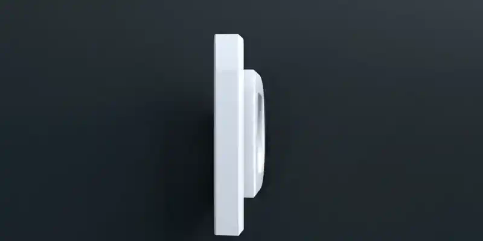
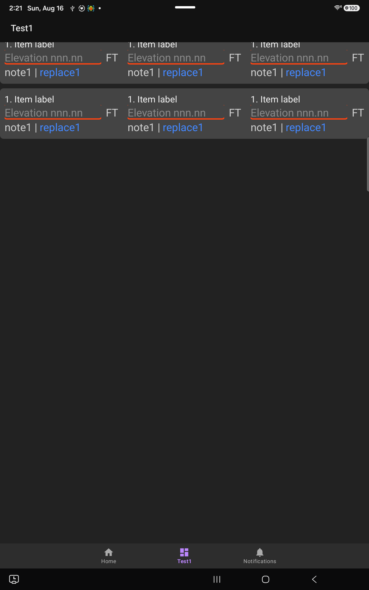

# LanDen Labs - UiDemo3
Android UI Demo 
 16-Aug-2026
 API 36 AndroidX Java
 [Home website](https://landenlabs.com/android/index.html)

Demonstrate basic Android UI components using a bottom navigation layout with Home, Test1, and Notifications fragments.

## Table of Contents
1. [Test1](#test1)

---

**Test1**

[To Top](#table)
---
